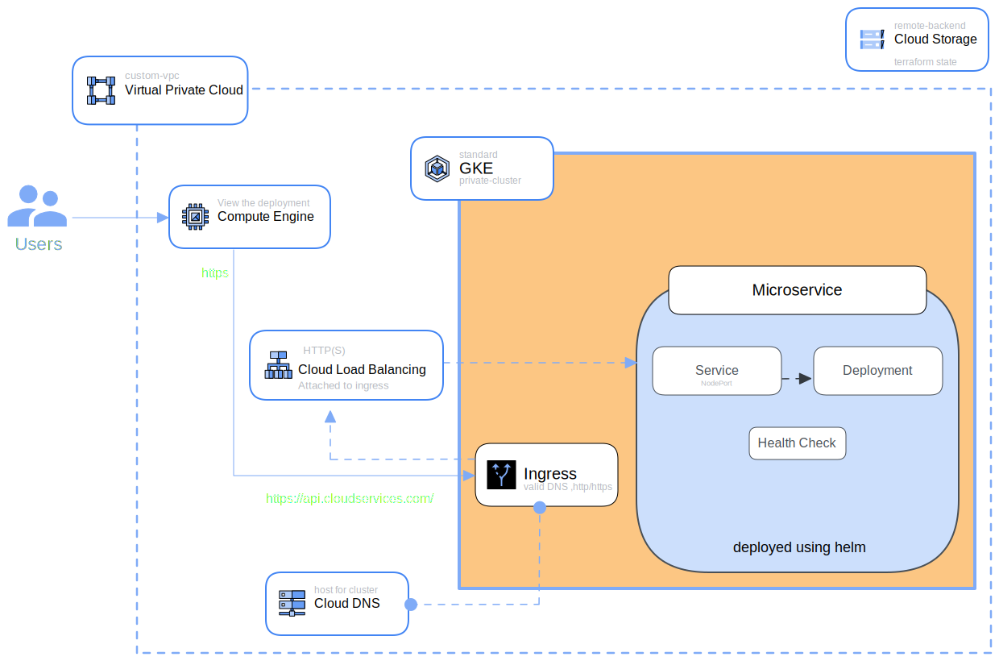

# cloud-service-exercise

## GCP Architecture Diagram



---

## Requirements

(Must Have)

- [x] Custom VPC
- [x] GKE Standard Private Cluster
- [x] Microservice Deployed using helm
- [x] Accessbile using a DNS (http or https)
- [x] Unit testing
- [ ] External data source(use python script) to create firewall rules
  - [ ] Allow egress from nodes to GKE master
  - [ ] Allow all communication between nodes and pods
- [x] Setup health checks for microservices

(Should Have)

- [x] Securing microservice using HTTPS
- [x] Using remote terraform state
- [ ] Define restrictive network policies for micro-service namepspace - default deny ingress and egress
- [x] Automated DNS records creation for the Service/Ingress
- [ ] Automated Certificate Provisioning for the Service/Ingress
- [x] Setup Monitoring using Stack Drivcer
- [ ] Istio Setup

---

### **Dependencies**

1. Terraform : [install terraform](https://developer.hashicorp.com/terraform/tutorials/aws-get-started/install-cli)
2. GCP Cloud Account
3. Golang : [install golang](https://go.dev/doc/install)

## **Connecting Cloud Shell to Private GKE Cluster**

**Step 1** : Paste this in the CloudShell CLI to add your CloudShell's IP to authorized_cidrs in the Control Plane

   ```bash
   terraform apply -auto-approve -var authorized_cidr=$(dig +short myip.opendns.com @resolver1.opendns.com) -var project_id=<PROJECT_ID> 
   ```

**Step 2** : Run this to Authenticate

   ```bash
   gcloud container clusters get-credentials k8s-cluster \
   --project <PROJECT_ID>
   ```

---

## **Running unit tests**

Paste the below command to run unit test cases in CloudShell CLI

```bash
cd ./terraform
go test ./... -v -timeout 60m
```

## **Provision Infrastructure Using Terraform**

On your Cloud Shell CLI, Run the below commands

```bash
terraform init
terraform validate
terraform apply -auto-approve -var authorized_cidr=$(dig +short myip.opendns.com @resolver1.opendns.com) -var project_id=<PROJECT_ID> 
```

---

## **Setting up Cloud Build for the pipeline**

```text
In Progress...
```

---

## **Deploying the microservice using Helm**

source: [helm](https://github.com/aayvyas/cloud-service-exercise/tree/main/helm)

Paste the below code in Cloud Shell CLI

```bash
cd ./helm
helm upgrade <GIVE_A_NAME_OF_YOUR_CHOICE> . --install
```

## **Deploying using kubectl and manifests files**

source: [kubernetes](https://github.com/aayvyas/cloud-service-exercise/tree/main/kubernetes)

Paste the below code in Cloud Shell CLI

```bash
cd ./kubernetes
kubectl apply -f .
```

---

## **View the deployment**

> **NOTE** : As the DNS name used here is a private DNS whose scope is only limited to the VPC, to see the deployment we need to be part of the network.

To view the deployment :

**Step 1** : Go to *Compute Engine* > *VM instances*

**Step 2** : Look for a instance **test-vm** , ssh into it

**Step 3** : paste the below command to view the see the output

```bash
# --insecure , as the TLS certificate is self-signed
curl https://api.cloudservices.com/ --insecure
```

### **Benchmarking HPA**

```bash
sudo apt-get -y install apache2-utils 
sudo apt-get -y install apache2 

ab -n 100000 -c 1000 https://api.cloudservices.com/
```
